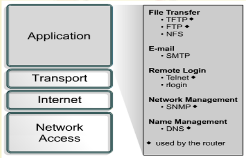

# Intro

# Application Layer-I

- Application Layer is provided by the program that uses TCP/IP for communication.
- An application is a user process cooperating with another process usually on a different host (there is also a benefit to application communication within a single host).
- Example of applications: Telnet, SMTP, FTP etc.
- Interface between the application and transport layers is defined by port numbers and “************sockets************”

Operation

Sample Protocols

Protocol Stack Implementation in a Host

How Application Data Passes Through Different Layers

Application Layer Interfacing

## Responsibilities of Application Layer

 

- Identifying and establishing the availability of intended communication partners
- Synchronizing cooperation applications
- Establishing agreement on procedures for error recovery
- Controlling data integrity

## Application Layer Examples

- Domain Name System (DNS)
- File Transfer Protocol (FTP)
- Hypertext Transfer Protocol (HTTP)
- Simple Mail Transport Protocol (SMTP)
- Simple Network Management Protocol (SNMP)
- Telnet, etc.

## DNS

- Domain Name System (DNS) is a system used for translating names of domains into IP addresses
- There are more than 200 top-level domains on the internet examples of which include the following:
    - .in — India
    - .us — United States
    - .uk — United Kingdom
    - .edu — educational sites
    - .com — commercial sites
    - .gov — government sites
    - .org — non-profit sites
    - .net — network service

## FTP and TFTP

- FTP is a reliable, connection-oriented service that uses TCP to transfer files between systems that support FTP
- TFTP is a connectionless service that uses User Datagram Protocol (UDP)
    - TFTP is used on routers to transfer configuration files and Cisco IOS images
    - TFTP is designed to be small and easy to implement

## HTTP

## SMTP

E-mail services communicate with each other using the Simple Mail Transport Protocol (SMTP) to send and receive mail

## SNMP

The Simple Network Management Protocol (SNMP) is an application layer protocol that facilitates the exchange of management information between network devices.

## Telnet

Telnet client software provides the ability to log into a remote internet host that is running a Telnet server application and then to execute commands from the command line

## Network API : “Socket”

Server and Client exchange messages over the network through a common ********************Socket API********************

